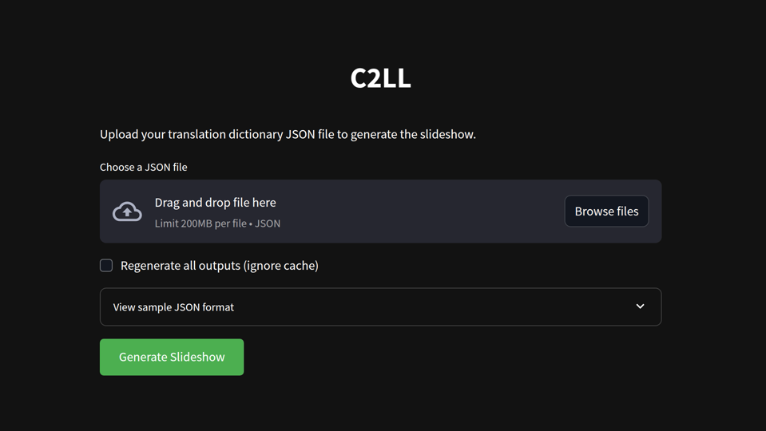

# C2LL

Dynamic content generator that generates a slideshow based on a dictionary file to help you learn languages.

Uses [Luke Smith's](https://github.com/LukeSmithxyz/voidrice/blob/master/.local/bin/slider) slider script.

# Dependencies
- pydub
- gtts
- pyaudioop
- audioop-lts
## Frontend dependencies
- streamlit

# Usage
- Create a dictionary file (example in `dictionaries/dictionary.json`)
- Install dependencies: `pip install -r requirements.txt`
- Run the frontend: `streamlit run app.py`
  - OR, run `main.py` with the following arguments:
    - path to the dictionary json file
    - `--regenerate` if you need to regenerate all outputs. Cache is used by default.
 
The output (.mp4) will be generated in the project's root directory.
# Notes
In the dictionary file avoid curly brackets, single quotes, and colons.
Double quotes can be used in the json if escaped with a backslash.

If the process seems to be paused, then terminate it and read the error message.
