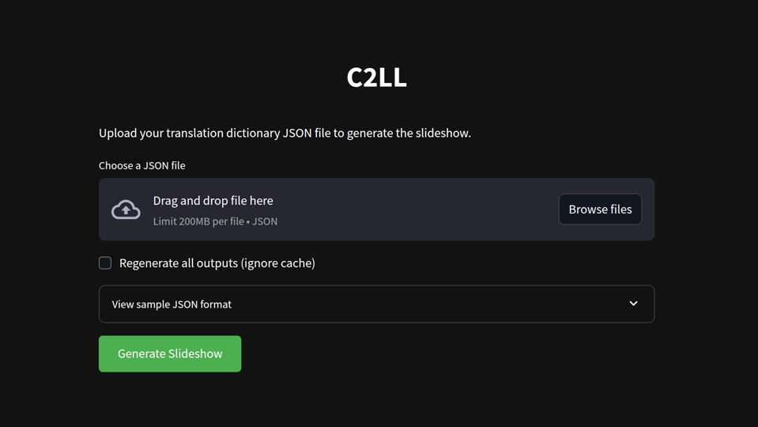

# C2LL

Dynamic content generator that generates a slideshow based on a dictionary file to help you learn languages.

Uses [Luke Smith's](https://github.com/LukeSmithxyz/voidrice/blob/master/.local/bin/slider) slider script.

# Setup

## Installation

1. Install Ollama from https://ollama.ai

2. Pull a language model (recommended: llama3.2:1b for low memory usage) and run it in the background.
```bash
ollama serve  # Start Ollama server
ollama pull llama3.2:1b
```

3. Install Python dependencies:
```bash
pip install -r requirements.txt
```

# Usage

## Streamlit Frontend (Recommended)
Run the web interface:
```bash
streamlit run app.py
```

Features:
- Upload dictionary JSON files
- Generate language learning slideshows
- Local translation tool (add/remove/translate terms)
- Dictionary management

## Command Line
Run with CLI arguments:
```bash
python main.py <path-to-dictionary.json> [--regenerate]
```

Arguments:
- `path-to-dictionary.json`: Path to your dictionary JSON file
- `--regenerate`: Regenerate all outputs (ignore cache)

The output video (.mp4) will be generated in the project's root directory.

# Dictionary Format

Example structure (see `dictionaries/dictionary.json`):
```json
{
    "hello": {
        "zh-CN": [
            {"translation": "你好", "romanization": "Nǐ hǎo"}
        ],
        "hi": [
            {"translation": "नमस्ते", "romanization": "namaste"}
        ]
    }
}
```

# Notes
- Avoid curly brackets, single quotes, and colons in dictionary entries
- Double quotes can be escaped with backslash if needed
- If the process pauses, terminate and check error messages
- Ollama server must be running for local translations
